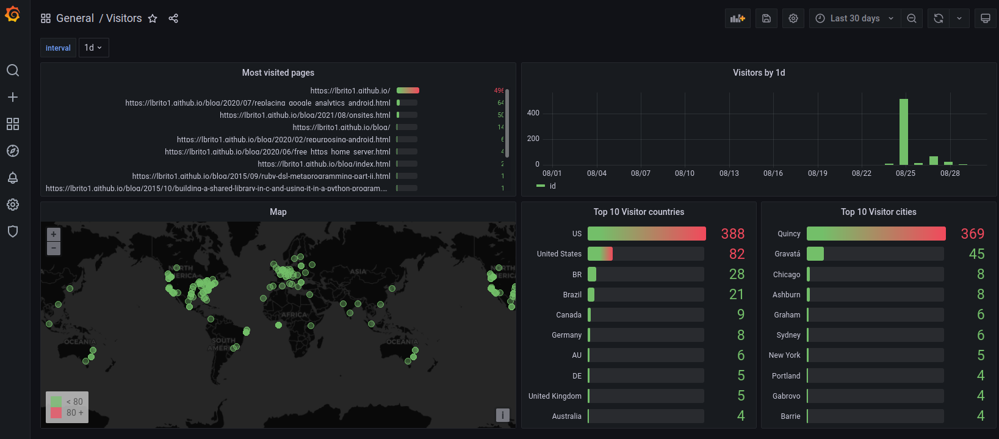

# Android analytics

Web analytics software so simple it runs on your phone.

> "This is a damn fine cup of coffee."
-- Agent Cooper

## Table of Contents
* [About](#about)
* [How this works](#how-this-works)
* [Requirements](#requirements)
* [Installation](#installation)
* [Notes](#notes)

## About

**Here's an [in-depth blog post](https://lbrito1.github.io/blog/2020/07/replacing_google_analytics_android.html) about this project.**

This is a web analytics tool that runs on Android devices. If you're just curious about who visits your personal page, this might be good enough for you.

It's really just a glorified nginx log visualization tool. Annonymized visits are stored in your phone, put into a database, and viewed with Grafana.

## How this works

When someone visits your website, Javascript sends a `GET <ngrok-domain>/damn_fine_coffee`[1]. Ngrok will redirect that to your phone, in which Nginx will create a log entry (it doesn't log other endpoints[1]).

Every day a cron job processes the day's logs[2]. Invalid logs (duplicated requests or requests originating from non-monitored domains) are discarded, IPs are annonymized using MD5 hashing, and geo info (city-level) is calculated from the IPs. Each valid log entry becomes a row of the `hits` table.

The `hits` table is then used by Grafana to create all kinds of visualization -- at this point its up to you!

## Requirements

1. An Android phone running [Termux](https://termux.com/) (recommended: set up [SSH remote access](https://wiki.termux.com/wiki/Remote_Access)). Remember to press "Acquire wakelock" on Termux as well;
2. An ngrok account (or any equivalent service)

## Installation

In your Android phone:
1. Clone this repository and `cd` into it
2. Create your `.env` config file with `cp -n .env.template .env` and add your passwords, domains etc. If you don't have a SSL certificate, comment out the SSL-related parts of `config/nginx.conf` (more on that in the _About SSL_ section below)
3. Run the setup script: `bash bin/setup.sh`
4. Install ngrok on your phone (search for "install ngrok on termux" for a bunch of tutorials showing how)
5. Run ngrok with `ngrok http localhost:8080`, take note of the URL
6. In the website you want to monitor, add a call to your ngrok URL: ``
7. Install Grafana on Termux (I used [AnLinux](https://f-droid.org/en/packages/exa.lnx.a/) for this)

All set! Run `tail -f log/nginx.access.log` on your phone and try visiting your monitored website. You should see the request getting logged.

Next step is to manually run the compiler job (`./bin/compile_logs.sh`), which will send that request to the DB (by default it is ran daily at 23:59 -- just run it manually once to see if everything is OK).

Open `http://<your-phones-local-ip>:3000` to open Grafana and create some charts! 🎉

## Notes

[1] The web is full of crawlers, mostly hitting `/`, but also `/tp-link`, `/admin` etc. We want to just ignore those.

[2] Leveraging [Nginx log rotation](https://www.nginx.com/resources/wiki/start/topics/examples/logrotation/).
